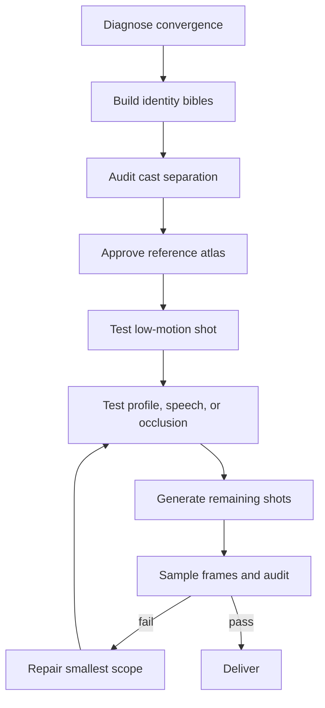

# Distinct Video Faces

**Faces with identity—not the AI average.**

`direct-distinct-video-faces` is an open Agent Skill for designing AI-video casts that are both:

1. **distinct from one another**, so every character does not collapse into the same polished “AI face”; and
2. **stable across shots**, so a character remains recognizable through angle, speech, expression, lighting, and motion.

It works with skills-compatible agents and produces platform-neutral or model-adapted workflows for Kling, Jimeng, Hailuo, Veo, Wan/ComfyUI, and other text-to-video or image-to-video systems.

> This skill reduces convergence and identity-drift risk. It cannot make a probabilistic video model deterministic, and it does not modify model weights.

## Install

Interactive installation:

```bash
npx skills@latest add hongzuoj-pixel/distinct-video-faces
```

Install globally for Codex without prompts:

```bash
npx skills@latest add YOUR_GITHUB_USERNAME/distinct-video-faces \
  --skill direct-distinct-video-faces -g -a codex -y
```

The same repository can be installed for Claude Code, Cursor, Gemini CLI, GitHub Copilot, and other clients supported by the open Skills CLI.

## Use

Ask your agent:

```text
Use $direct-distinct-video-faces to design two believable leads for a
30-second convenience-store argument. Make their faces clearly different,
keep each identity stable across speech and profile turns, and output a
Kling-ready reference plan, shot prompts, and QC checklist.
```

You can also give it existing images or clips:

```text
Audit these generations with $direct-distinct-video-faces. Diagnose why the
cast looks related, identify identity drift by shot, and give the cheapest
regeneration plan that preserves accepted footage.
```

## What it changes

| Common workflow | Distinct Video Faces |
|---|---|
| “Beautiful cinematic woman” copied across the cast | Observable geometry, texture, asymmetry, movement, and forbidden drift per person |
| Clothing and hair used as the only differences | Pairwise cast-separation matrix across nine identity axes |
| Every shot generated independently | Reference-first gates and immutable identity locks |
| Prompt accepted because it sounds detailed | Machine-audited character and prompt packs |
| Finished clip judged from one attractive frame | First/middle/last plus stress-motion frame sampling |
| Full regeneration after one failure | Minimal shot- or span-level repair |

## Workflow



## Deterministic checks

The skill includes three dependency-light utilities:

```bash
# Detect incomplete identity bibles, beauty-prior language, and cast collisions
python3 skills/direct-distinct-video-faces/scripts/audit_character_pack.py character-pack.json

# Check identity-lock reuse, references, preservation anchors, and overloaded shots
python3 skills/direct-distinct-video-faces/scripts/audit_prompt_pack.py prompt-pack.json

# Sample a clip for visual QC (requires ffmpeg + ffprobe)
python3 skills/direct-distinct-video-faces/scripts/sample_video_frames.py clip.mp4 \
  --out audit-frames --samples 7
```

Data formats are documented in [`data-contracts.md`](skills/direct-distinct-video-faces/references/data-contracts.md). Example files are under [`examples/`](examples/).

## Why this is different

Most character-consistency tools optimize **within-character similarity**: make person A look like person A again. That is necessary but incomplete. A cast can be individually stable and still look like variations of one generated face.

This project optimizes two separate goals:

- **Within-character stability** across shots and motion.
- **Between-character distance** across silhouette, proportions, landmarks, texture, asymmetry, expression, and movement.

It also uses an intervention ladder: fix prompt pressure first, then add references, staging, model routing, or training only when a cheaper level fails a named acceptance test.

## Evaluation

The repository includes benchmark scenarios in [`evals/benchmark.json`](evals/benchmark.json). A serious claim should report:

- cast pairwise uniqueness before and after;
- QC scores for identity geometry, temporal stability, and angle robustness;
- pass rate on low-motion and stress shots;
- generation count or cost needed to reach a pass;
- model/version/date, because generator behavior changes.

Do not publish only cherry-picked hero frames. Include failed attempts and the repair that fixed—or did not fix—them.

## Limitations

- Prompt and reference discipline cannot override every model's learned face prior.
- Multi-person shots, long dialogue, large head turns, occlusion, and strong face restoration remain high-risk.
- Face embeddings are useful secondary signals, not proof of visual identity or cast distinctiveness.
- Real-person likenesses require authorization and must not be presented as authentic evidence.
- Platform capabilities change; verify exposed controls against current official documentation.

## Related work

This project learns from the broader open-source character-consistency and AI-video skill ecosystem, especially reference-first production, intervention ladders, model routing, and testable output contracts. The implementation and its distinct-cast objective are original. Useful neighboring projects include:

- [`divolleggett/character-consistency-skill`](https://github.com/divolleggett/character-consistency-skill)
- [`GenielabsOpenSource/style-consistency-ai`](https://github.com/GenielabsOpenSource/style-consistency-ai)
- [`lostinheaven-knt/video-prompt-skill`](https://github.com/lostinheaven-knt/video-prompt-skill)
- [`vercel-labs/skills`](https://github.com/vercel-labs/skills)

## Contributing

Issues and pull requests are welcome, especially:

- reproducible before/after runs on named model versions;
- platform adapter corrections backed by official docs;
- benchmark cases that expose identity convergence;
- improvements to multilingual face-attribute comparisons;
- privacy-preserving local evaluation tools.

Please do not submit unlicensed face datasets or real-person deepfake examples.

## License

MIT © 2026 Ailin JIN

---

## 中文简介

`direct-distinct-video-faces` 是一个解决 AI 视频“多人长成同一张网红脸”和“同一角色跨镜头变脸”的 Agent Skill。它不会承诺底层模型百分之百听话，而是通过人物身份圣经、角色分离矩阵、参考图门禁、逐镜头提示词、自动检查和视频抽帧质检，提高生成成功率并减少无效重做。

公开版最重要的定位不是“万能视频提示词”，而是：**让不同的人真的像不同的人，同时让同一个人始终像同一个人。**
