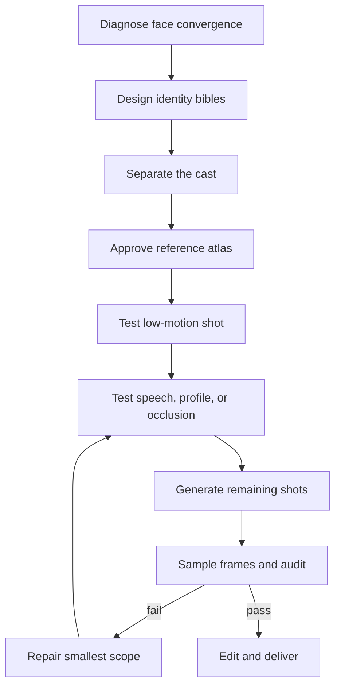

# Distinct Video Faces

[](https://github.com/hongzuoj-pixel/distinct-video-faces/actions/workflows/validate.yml)
[](https://github.com/hongzuoj-pixel/distinct-video-faces/releases)
[](LICENSE)
[](skills/direct-distinct-video-faces/SKILL.md)

## Stop casting the same AI face in every role.

**Keep each character consistent—without making the whole cast look alike.**

AI-video workflows usually solve only half the problem: they try to keep one character stable from shot to shot. But a film can have perfect continuity and still look synthetic when every actor shares the same polished face.

`direct-distinct-video-faces` is an open Agent Skill that treats both goals as first-class constraints:

- **Within-character stability:** person A remains person A through speech, profiles, expressions, lighting, and motion.
- **Between-character distinctiveness:** person A, B, and C do not collapse into variations of one generated face.

Built for AI filmmakers using Kling, Jimeng, Hailuo, Veo, Wan/ComfyUI, or other text-to-video and image-to-video workflows.

> The skill plans, prompts, audits, and repairs your workflow. Your chosen video generator still renders the footage. No new generation API or paid dependency is required by this repository.

**[中文快速开始](#中文快速开始)**

## Try it in 60 seconds

Install with the open Skills CLI:

```bash
npx skills@latest add hongzuoj-pixel/distinct-video-faces
```

Then ask your agent:

```text
Use $direct-distinct-video-faces to design two believable leads for a
30-second convenience-store argument. Make their faces unmistakably
different, keep each identity stable through dialogue and profile turns,
and give me a Kling-ready reference plan, shot prompts, and QC checklist.
```

Already generated footage? Start with an audit instead:

```text
Audit these clips with $direct-distinct-video-faces. Show me where the cast
looks related or a face drifts, explain the likely cause, and give me the
smallest regeneration plan that preserves accepted shots.
```

For a first test, use a two-person dialogue with one close-up, one profile, and one speaking shot per character. That exposes both cast convergence and identity drift without spending on a full film.

## What you get

The agent produces a practical production pack—not just a longer prompt:

1. **Identity bibles** with stable geometry, texture, asymmetry, movement, and forbidden drift for each character.
2. **Cast-separation matrix** showing exactly where two characters still overlap.
3. **Reference-image plan** with approval and rejection gates before expensive video generation.
4. **Platform-adapted shot prompts** with identity, performance, camera, world, preservation, and failure constraints separated.
5. **Frame-level QC and repair plan** that regenerates the smallest failed shot or span instead of restarting everything.

## Why this is different

Most character-consistency methods optimize only this:

> Does this character still look like the same person?

Distinct Video Faces also asks:

> Do these different characters actually look like different people?

| Common AI-video workflow | Distinct Video Faces |
|---|---|
| “Beautiful cinematic woman” reused across the cast | Observable geometry, texture, asymmetry, expression, and movement per person |
| Hair and clothing carry all the difference | Pairwise separation across nine identity axes |
| Each shot is generated independently | Reference-first gates and immutable identity locks |
| A detailed-sounding prompt is assumed to be good | Character and prompt packs are checked by executable audits |
| One attractive frame is accepted | First, middle, last, and stress-motion frames are inspected |
| One bad moment triggers a complete rerender | The smallest failed shot or temporal span is repaired first |

The goal is not to make every face strange. It is to build a believable cast with the natural variation real productions get from actual casting.

## Built-in checks

The repository includes dependency-light tools that can catch expensive mistakes before or after rendering:

```bash
# Find incomplete identity bibles, generic beauty language, and cast collisions
python3 skills/direct-distinct-video-faces/scripts/audit_character_pack.py \
  examples/character-pack.json

# Check identity-lock reuse, references, preservation anchors, and overloaded shots
python3 skills/direct-distinct-video-faces/scripts/audit_prompt_pack.py \
  examples/prompt-pack.json

# Sample a video for first/middle/last and motion-stress QC
# Requires ffmpeg + ffprobe
python3 skills/direct-distinct-video-faces/scripts/sample_video_frames.py clip.mp4 \
  --out audit-frames --samples 7
```

The included two-character example currently returns:

```text
PASS
PAIR: Lin Qiao / Zhou Ning | uniqueness: 82.6/100 | similar axes: none
```

The score is a production warning signal, not a scientific claim that facial identity can be reduced to one number. Human review remains the final gate.

Data formats are documented in [`data-contracts.md`](skills/direct-distinct-video-faces/references/data-contracts.md), with ready-to-run packs under [`examples/`](examples/).

## Production workflow



The intervention ladder starts with the cheapest fix—prompt pressure and reference selection—before recommending staging changes, model routing, adapters, or training.

## Install options

Interactive installation:

```bash
npx skills@latest add hongzuoj-pixel/distinct-video-faces
```

Install globally for Codex without prompts:

```bash
npx skills@latest add hongzuoj-pixel/distinct-video-faces \
  --skill direct-distinct-video-faces -g -a codex -y
```

The repository can also be installed for Claude Code, Cursor, Gemini CLI, GitHub Copilot, and other clients supported by the open Skills CLI.

## Honest status

This is a public beta. The workflow, data contracts, audits, tests, and installation path are implemented; broader before/after generation benchmarks across platforms are the next milestone.

The skill reduces convergence and identity-drift risk. It cannot make a probabilistic generator deterministic, modify model weights, or rescue every long dialogue, occlusion, rapid head turn, or crowded multi-person shot. Platform capabilities also change, so current controls should be checked against official documentation.

If you publish a test, please include the model/version/date, generation count, failed attempts, and repair steps—not only the best hero frame.

## Evaluation

Benchmark scenarios live in [`evals/benchmark.json`](evals/benchmark.json). Useful reports include:

- cast pairwise uniqueness before and after;
- identity geometry, temporal stability, and angle robustness;
- low-motion and stress-shot pass rates;
- generation count or cost needed to reach a pass;
- model, version, settings, and date.

## Related work

This project learns from the wider character-consistency and AI-video ecosystem, especially reference-first production, intervention ladders, model routing, and testable output contracts. Its primary contribution is making **cast-level distinctiveness** and **per-character continuity** separate, auditable objectives.

Useful neighboring projects include:

- [`divolleggett/character-consistency-skill`](https://github.com/divolleggett/character-consistency-skill)
- [`Nagacash/character-continuity-skill`](https://github.com/Nagacash/character-continuity-skill)
- [`GenielabsOpenSource/style-consistency-ai`](https://github.com/GenielabsOpenSource/style-consistency-ai)
- [`Gusanidas/different-faces-pipeline`](https://github.com/Gusanidas/different-faces-pipeline)
- [`vercel-labs/skills`](https://github.com/vercel-labs/skills)

## Contributing

Issues and pull requests are especially welcome for:

- reproducible before/after runs on named model versions;
- platform-adapter corrections backed by official documentation;
- benchmark cases that expose identity convergence;
- multilingual face-attribute comparisons;
- privacy-preserving local evaluation tools.

Please do not submit unlicensed face datasets or real-person deepfake examples.

## 中文快速开始

**别再让一部 AI 视频里的所有角色，都像同一张“网红脸”换了发型。**

这个 Skill 同时解决两个不同的问题：

- **同一个人跨镜头不变脸**：说话、侧脸、表情、灯光和运动时仍能认出是同一角色；
- **不同角色之间不撞脸**：不是只换衣服和发型，而是从脸型、比例、五官关系、皮肤质感、不对称、表情习惯和动作特征上真正拉开差异。

安装：

```bash
npx skills@latest add hongzuoj-pixel/distinct-video-faces
```

安装后可以直接对 Agent 说：

```text
使用 $direct-distinct-video-faces，为一段 30 秒便利店争执设计两名主角。
两个人必须一眼就能区分，并且在说话和侧脸镜头中保持各自身份稳定。
请输出适用于 Kling 的参考图计划、分镜提示词和质检清单。
```

你也可以上传已经生成的图片或视频，让它找出哪些角色长得太像、哪一个镜头发生了变脸，以及最省成本的重生成方案。

如果它帮助了你的项目，欢迎提交测试结果、Issue 或 Pull Request。真实的失败案例和修复过程，比只展示一张最好看的成片更有价值。

## License

MIT © 2026 金宏祚
